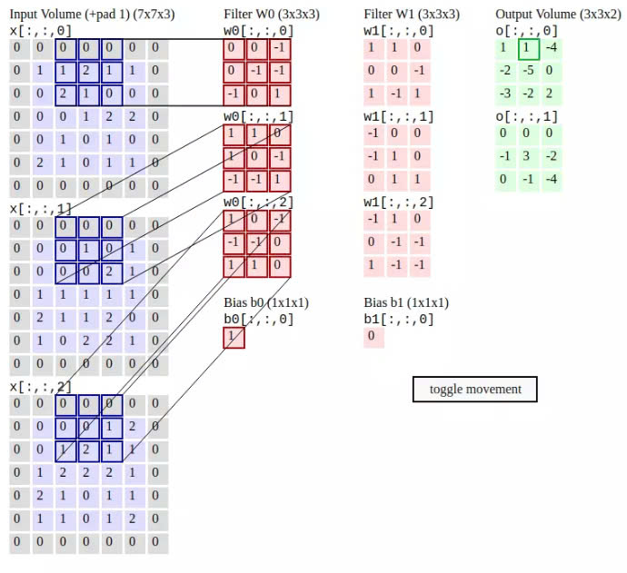
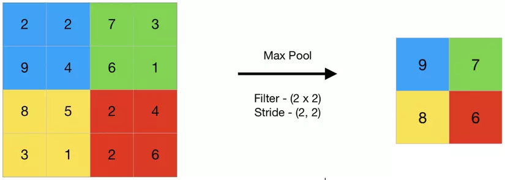
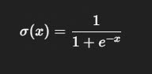
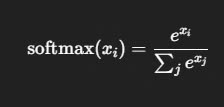

# Convolutional Neural Network (CNN)

## 1. Định nghĩa
Convolutional Neural Network (CNN) là một loại mạng nơ-ron chuyên biệt được sử dụng phổ biến trong xử lý ảnh và thị giác máy tính (Computer Vision).

CNN được thiết kế để tự động và thích nghi trích xuất các đặc trưng quan trọng từ dữ liệu ảnh thông qua các lớp tích chập (convolution).

## 2. Tại sao cần CNN?
- Ảnh RGB kích thước 100x100 có tới **30,000 pixel** → dẫn đến mạng Fully Connected có **rất nhiều tham số** (weights, biases).
- Điều này khiến mô hình dễ **overfitting** và **tốn tài nguyên tính toán**.
- CNN giải quyết vấn đề này bằng cách:
  - **Chia nhỏ ảnh thành từng vùng nhỏ (receptive field)**
  - **Sử dụng cùng một bộ lọc (filter) để quét toàn ảnh**
  - **Giảm đáng kể số lượng tham số mà vẫn giữ được đặc trưng ảnh**

## 3. Kiến trúc CNN cơ bản

### Convolution Layer
Convolution (lớp tích chập) là lớp đầu tiên trích xuất các đặc tính từ hình ảnh. Tham số lớp này bao gồm một tập hợp các bộ lọc có thể học được.

Các bộ lọc đều nhỏ thường có kích cỡ hai chiều đầu tiên khoảng 3x3 hoặc 5x5, và có độ sâu bằng với độ sâu của đầu vào. Bằng cách trượt dần bộ lọc theo chiều ngang và dọc trên ảnh, chúng thu được một Feature Map chứa các đặc trưng được trích xuất từ trên hình ảnh đầu vào.

Quá trình trượt các bộ lọc thường có các giá trị được quy định bao gồm:
- **padding**: quy định bộ đệm của bộ lọc hay chính là phần màu xám được thêm vào ảnh
- **stride**: quy định bước nhảy trong quá trình thực hiện.



Với mỗi kernel khác nhau ta sẽ học được những đặc trưng khác nhau của ảnh, nên trong mỗi convolutional layer ta sẽ dùng nhiều kernel để học được nhiều thuộc tính của ảnh. Vì mỗi kernel cho ra output là 1 matrix nên k kernel sẽ cho ra k output matrix.

Ta kết hợp k output matrix này lại thành 1 tensor 3 chiều có chiều sâu k. Output của convolutional layer sẽ qua hàm activation function trước khi trở thành input của convolutional layer tiếp theo.

### Pooling Layer
Pooling layer thường được dùng giữa các convolutional layer, để giảm kích thước dữ liệu nhưng vẫn giữ được các thuộc tính quan trọng.

Kích thước dữ liệu giảm giúp giảm việc tính toán trong model. Trong quá trình này, quy tắc về stride và padding áp dụng như phép tính convolution trên ảnh.



Ví dụ ảnh đầu vào có kích thước 4 x 4. Ta dùng Max Pooling 2 x 2, thì nó sẽ:
1. Chia ảnh thành các ô nhỏ 2 x 2.
2. Mỗi ô ta lấy giá trị lớn nhất trong 4 giá trị đó (nếu là Max Pooling).
3. Kết quả: ảnh đầu ra có kích thước 2 x 2.

### Fully Connected Layer
Sau khi ảnh được truyền qua nhiều convolutional layer và pooling layer thì model đã học được tương đối các đặc điểm của ảnh thì tensor của output của layer cuối cùng sẽ được là phẳng thành vector và đưa vào một lớp được kết nối như một mạng nơ-ron.

Với FC layer được kết hợp với các tính năng lại với nhau để tạo ra một mô hình. Cuối cùng sử dụng softmax hoặc sigmoid để phân loại đầu ra.

### Sigmoid
Công thức:



Đặc điểm:
- Đầu ra nằm trong khoảng (0, 1).
- Có thể hiểu như xác suất.
- Thường dùng cho bài toán nhị phân (binary classification).

Ví dụ nếu ta phân loại xem ảnh có phải là mèo hay không, thì đầu ra là 1 giá trị → dùng sigmoid.
```
output = sigmoid(x)  # kết quả là 0.91 chẳng hạn → xác suất ảnh là "mèo"
```

### Softmax
Công thức:



Đặc điểm:
- Chuyển n đầu ra thành n xác suất, tổng cộng lại bằng 1.
- Dùng cho bài toán đa lớp (multi-class classification).

Ví dụ nếu ta phân loại xem ảnh là mèo, chó hay thỏ, thì đầu ra có 3 phần tử:
```
output = softmax([2.1, 1.3, 0.5])
# kết quả có thể là: [0.68, 0.22, 0.10]
→ Mô hình tin rằng ảnh là mèo với xác suất 68%.
```